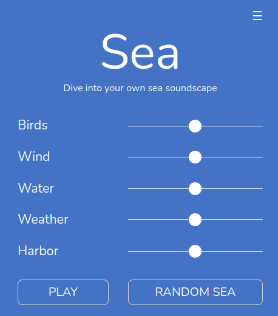

# Sea
Sea - Dive into your own sea soundscape

## About the project
In a complicated and stressed world you need time to relax and get back to your full strength.
*Sea* is a web application that lets you create your own sea soundscape.
The main aim is to give you a simple tool to relax and imagine yourself on a sea promenade of your choice. You can choose the soundscape and regulate intensities of elements as you wish. You like more birds? Or a stormy water? Or a walk on a rainy sea promenade? Harbor and ship sounds? No problem. Your changes will act immediately. You can build your own coast or take a sound dive in a random setting. Sit back and enjoy!

Sea is a private project that I started in June 2021. At that time I was looking for a simple solution that would allow me to relax during my studies at university.

## Live-Demo
You can check out the latest version (servers might be a bit slow sometimes):
* [Sea](https://moritzott.github.io/sea/)

## Mobile Version
If you have an Android mobile phone, I recommend to check out the Android-App of *Sea*. Since the servers for the web app are sometimes a bit slow, it is much better (performance and usage) to use an offline App. You can go the [Sea Android Repository](https://github.com/moritzott/sea-android) for installation files and info on Android.

And what about iOS? I'm sorry but currently you have to use the [web app](https://moritzott.github.io/sea/).

## Bugs, Errors and new Features
If you found a bug or want to ask for new features, you can open an [issue](https://github.com/moritzott/sea/issues) or send me an email (you can find the adress when you open the live demo and click on the menu sign. Then scroll down to *Contact*).

## Latest Version
Current version is **v.1.0-alpha**.

## Complementary project
If you prefer a walk in a forest you can check out my complementary project *Forest* to create your own forest soundscape:
* [Live-Demo](https://moritzott.github.io/forest/)
* [Repository](https://github.com/moritzott/forest)
* [Android App Version of Forest](https://github.com/moritzott/forest-android)

